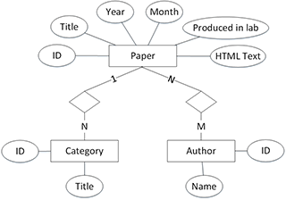
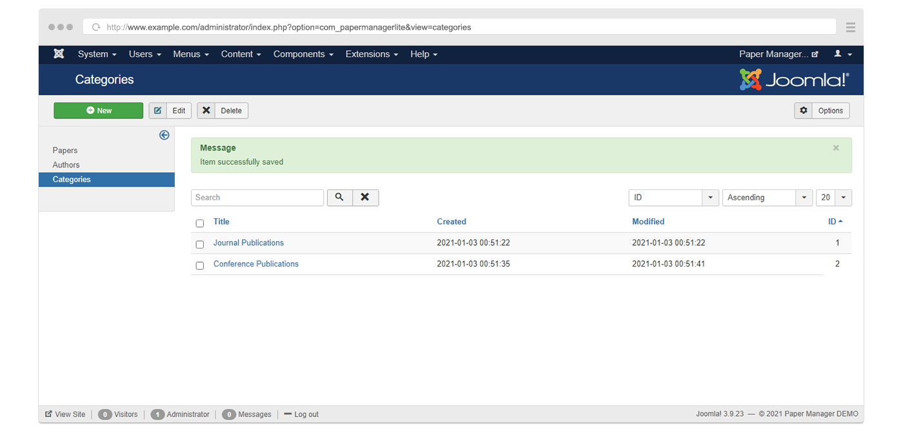
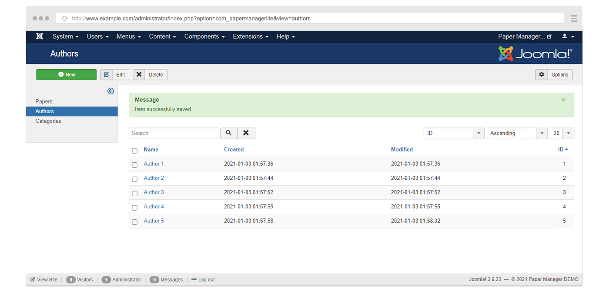
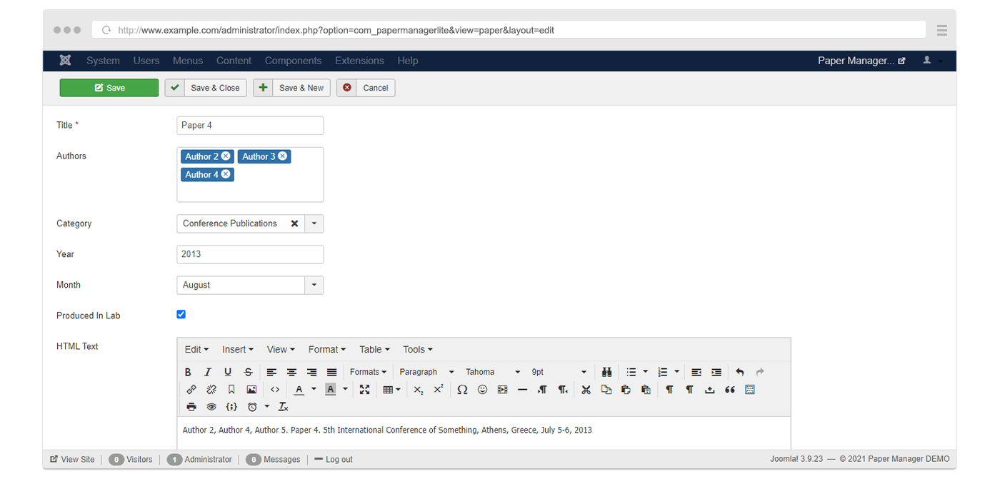
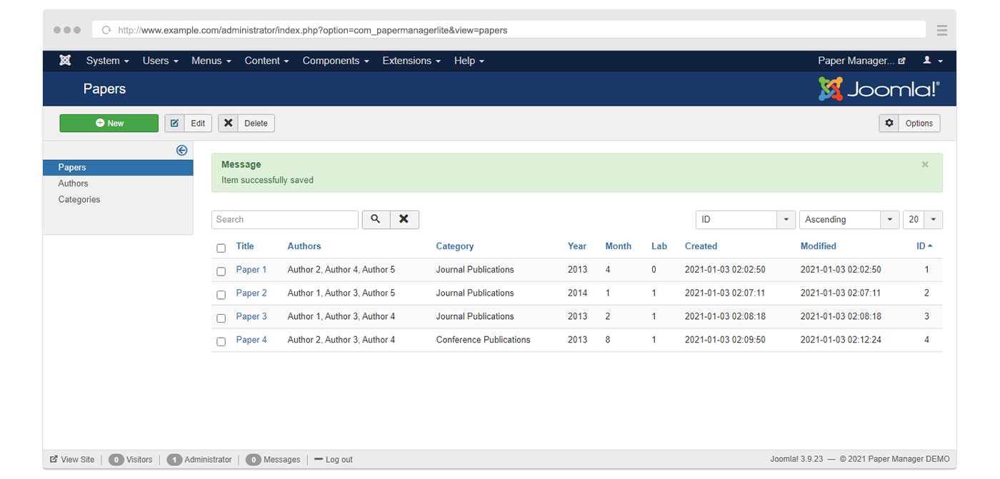
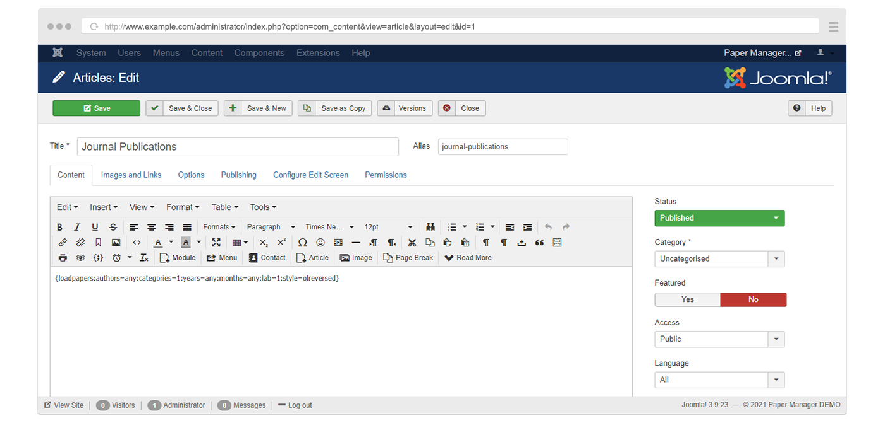
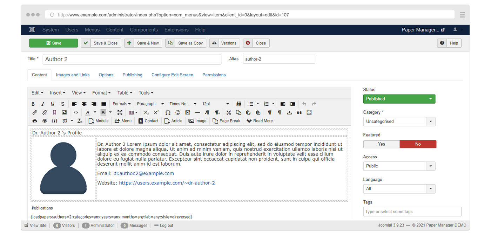
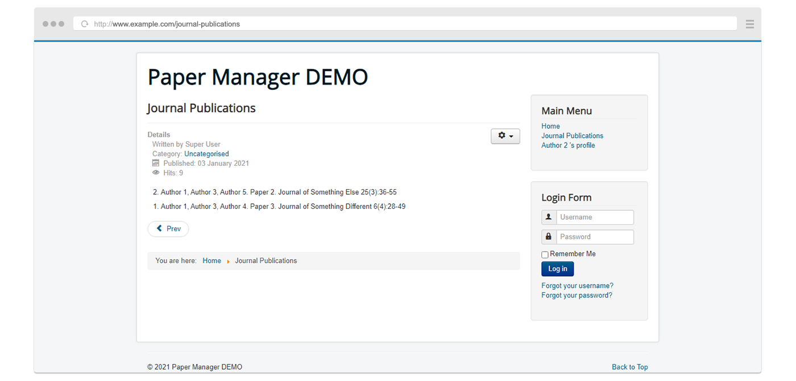
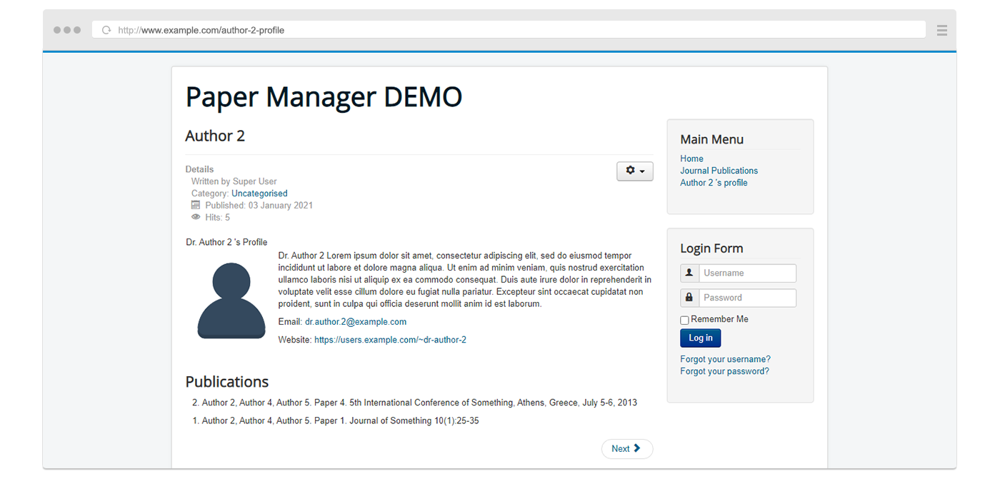

## Paper Manager


> Academic publication manager for Joomla! - Component & plugin.

Paper Manager is a Joomla 3 extension allowing the management of scientific publications. The extension is useful for websites related to research laboratories and organizations. Lists of scientific papers are commonly present in such websites. A single paper can be included in more than one of these lists. For example it can be shown on a page dedicated to the conference publications of the lab and also on the profile pages of the authors. Paper Manager allows a specific paper entry to be displayed on multiple pages without copying html code on all the relative articles. The extension consists of a component and a content plugin. The component is used for CRUD operations on papers, paper categories and authors while the plugin displays lists of papers inside content (ex. articles), using special code snippets.

Please note that the extension has not been thoroughly tested and it may contain critical bugs. You can open a [new issue](https://github.com/papermanager/papermanager/issues) on GitHub or contact  for bug reports and feature requests.

## Installation

The component and plugin come archived in a package file. A package is an extension that is used to install multiple extensions in one go. Follow the next steps to install Paper Manager on your website.

1. [Download](https://github.com/papermanager/papermanager/releases) the latest release.
2. From the administration of your Joomla website navigate to *Extensions &#8594; Extension Manager*.
3. Under *Upload & Install Joomla Extension* click *Choose File* and select the Paper Manager package installation file *pkg_papermanagerlite-x.x.x*.
4. Click *Upload & Install*. You will get a confirmation message that the component and plugin were successfully installed.
5. From the menu on the left click *Manage* and confirm that both the component and the plugin have been installed. Look up *Content - Paper Manager Lite Plugin*, *Paper Manager Lite* and *Paper Manager Lite Package*.

## Using the component

The Paper Manager component lets the user manage the paper collection. It offers three CRUD editors. One for the paper categories, another for the authors and a third one for the papers themselves. Each can be accessed from the administration by navigating to *Components &#8594; Paper Manager Lite &#8594; Categories*, *Components &#8594; Paper Manager Lite &#8594; Authors* and *Components &#8594; Paper Manager Lite &#8594; Papers* respectively. Each item in these lists has the following fields:

- Categories
  - `ID`: Record number in the database.
  - `Title`: The title of the category.
- Authors
  - `ID`: Record number in the database.
  - `Name`: The first and last name of the author.
- Papers
  - `ID`: Record number in the database.
  - `Title`: The title of the paper.
  - `Authors`: List of the paper authors - included in the authors editor.
  - `Category`: The paper category – included in the categories editor.
  - `Year`: The year of the publication.
  - `Month`: The month of the publication.
  - `Produced In Lab`: Checkbox – checked if the paper was produced in the lab.
  - `HTML Text`: The HTML text that will be used by the plugin to display the paper entry on the site.

<p align="center">
  
</p>

### Getting started with the Paper Manager component

- From the administration, navigate to *Components &#8594; Paper Manager Lite &#8594; Categories* and add the following entries:
  - Title: `Journal Publications`
  - Title: `Conference Publications`

<p align="center">
  
</p>

- Navigate to *Components &#8594; Paper Manager Lite &#8594; Authors* and add the following entries:
  - Name: `Author 1`
  - Name: `Author 2`
  - Name: `Author 3`
  - Name: `Author 4`
  - Name: `Author 5`

<p align="center">
  
</p>

- Navigate to *Components &#8594; Paper Manager Lite &#8594; Papers* and add the following entries:
  - Title: `Paper 1`, Authors: `{Author 2, Author 4, Author 5}`, Category: `Journal Publications`, Year: `2013`, Month: `April`, Produced in Lab: `Not Checked`, HTML Text: `Author 2, Author 4, Author 5. Paper 1. Journal of Something 10(1):25-35`
  - Title: `Paper 2`, Authors: `{Author 1, Author 3, Author 5}`, Category: `Journal Publications`, Year: `2014`, Month: `January`, Produced in Lab: `Checked`, HTML Text: `Author 1, Author 3, Author 5. Paper 2. Journal of Something Else 25(3):36-55`
  - Title: `Paper 3`, Authors: `{Author 1, Author 3, Author 4}`, Category: `Journal Publications`, Year: `2013`, Month: `February`, Produced in Lab: `Checked`, HTML Text: `Author 1, Author 3, Author 4. Paper 3. Journal of Something Different 6(4):28-49`
  - Title: `Paper 4`, Authors: `{Author 2, Author 3, Author 4}`, Category: `Conference Publications`, Year: `2013`, Month: `August`, Produced in Lab: `Checked`, HTML Text: `Author 2, Author 4, Author 5. Paper 4. 5th International Conference of Something, Athens, Greece, July 5-6, 2013`

<p align="center">
  
</p>

<p align="center">
  
</p>


## Using the plugin

The Paper Manager plugin loads Paper Manager publications within content (ex. articles). It works in a similar way with the *Content - Load Modules* plugin, which is included in the core Joomla distribution. Special code snippets are used in the content that are translated into HTML code in the front-end (lists of papers in our occasion).

You have to enable the plugin before using it. To do this, navigate to *Extensions &#8594; Plugin Manager* and enable *Content - Paper Manager Lite Plugin*.

From the same page (*Extensions &#8594; Plugin Manager &#8594; Content - Paper Manager Lite Plugin*), the plugin's [default parameters](#plugin-parameters) can also be edited.

### Getting started with the Paper Manager plugin

- From the article manager, create an article titled *Journal Publications* and a menu item of the same name targeting this single article.
- Edit this article and insert the following code in its content:

```html
{loadpapers:authors=any:categories=1:years=any:months=any:lab=1:style=olreversed}
```

<p align="center">
  
</p>

- From the article manager, create an article titled *Author 2* and a menu item of the same name targeting this single article.
- Edit this article and insert the following code in its content:

```html
{loadpapers:authors=2:categories=any:years=any:months=any:lab=any:style=olreversed}
```

<p align="center">
  
</p>

- Create two menu items pointing to the two newly created articles.

<p align="center">
  
</p>

<p align="center">
  
</p>

### Code snippets syntax

Code snippets should be written in the following form. Each snippet works as a query to the plugin. The plugin process the queries, retrieves the appropriate papers and generates the HTML code for each query/paper list.

```html
{loadpapers:authors=X:categories=X:years=X:months=X:lab=X:style=X}
```

*X* denotes a value. Six constraints are used in a single snippet:

- **authors**: The ID of a single author or the IDs multiple authors separated by comma.
  - Value range: `1 | ... | n | any`
  - Example: `1,20,12,23`
- **categories**: The ID of a single category or the IDs multiple categories separated by comma.
  - Value range: `1 | ... | n | any`
  - Example: `1,20,12,23`
- **years**: A single year (four digit format) or multiple years separated by comma.
  - Value range: `YYYY | any`
  - Example: `2013,2014`
- **months**: A single month (range from 1 to 12 format) or multiple months separated by comma.
  - Value range: `1 | ... | 12 | any`
  - Example: `7`
- **lab**: Defines whether to retrieve papers produced in the lab or outside of it. Value 1 stands for *produced in the lab* and 2 for *not produced in the lab*.
  - Value range: `1 | 2 | any`
  - Example: `1,20,12,23`
- **style**: The code that will wrap the papers lists. ( [more...](#style) )
  - Value range: `ul | ol | olreversed | div | none | default`
  - Example: `olreversed`

To omit a constraint from the query its value should be set to `any`. authors, categories, years, months and lab can be set to `any` if you don't want to constrain the output to some specific value. `any` does not work for style though. style accepts the value `default` in order to make use of the style set in the [plugin's parameters](#plugin-parameters).

### Plugin parameters

To edit the parameters of the plugin, navigate to *Extensions &#8594; Plugin Manager &#8594; Content - Paper Manager Lite Plugin*.

#### Style

The style of the code that will wrap papers lists. It can get the values `ul | ol | olreversed | div | none | default`. Each style outputs the following HTML code:

##### `ul` - Wrapped by unordered list

```html
<ul class="papermanager_front_list">
     <li class="papermanager_front_list_item">Item 1</li>
     <li class="papermanager_front_list_item">Item 2</li>
     …
     <li class="papermanager_front_list_item">Item n</li>
</ul>
```

##### `ol` - Wrapped by ordered list

```html
<ol class="papermanager_front_list">
     <li class="papermanager_front_list_item">Item 1</li>
     <li class="papermanager_front_list_item">Item 2</li>
     …
     <li class="papermanager_front_list_item">Item n</li>
</ol>
```

##### `olreversed` - Wrapped by reverse ordered list

```html
<ol reversed="" class="papermanager_front_list">
     <li class="papermanager_front_list_item">Item 1</li>
     <li class="papermanager_front_list_item">Item 2</li>
     …
     <li class="papermanager_front_list_item">Item n</li>
</ol>
```

##### `div` - Wrapped by Divs

```html
<div class="papermanager_front_list">
     <div class="papermanager_front_list_item">Item 1</div>
     <div class="papermanager_front_list_item">Item 2</div>
     …
     <div class="papermanager_front_list_item">Item n</div>
</div>
```

As it can be noticed, certain CSS classes are assigned to the generated HTML code to provide a way of stylizing the output. The following CSS rules can be used as a template:

```html
ul.papermanager_front_list{
}
ul.papermanager_front_list li.papermanager_front_list_item{
}
ol.papermanager_front_list{
}
ol.papermanager_front_list li.papermanager_front_list_item{
}
div.papermanager_front_list{
}
div.papermanager_front_list div.papermanager_front_list_item{
}
```


## Uninstallation

1. From the administration of your Joomla website navigate to *Extensions &#8594; Extension Manager* and select *Manage* from the menu on the left.
2. Uninstall *Paper Manager Lite Package*. If you get an error message uninstall *Content - Paper Manager Lite Plugin* and/or *Paper Manager Lite* as well.
